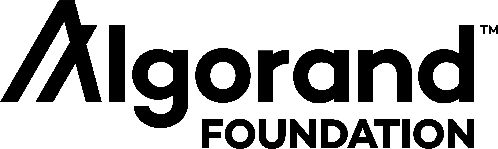

# Grow Algorand

Here you can find an index of ecosystem programs operated by Algorand Foundation.

If you want to develop on Algorand and are trying to learn how to do that, you can find a list of [development learning materials here](#Development-Learning-Material).

* **For project owners**
  * **looking to get funds from the Algorand ecosystem?** check out the [Algorand Grant Program](#Grant-Program).
  * **Looking for Algorand community developers?** check out the [Algorand Project-Dev Plaza](#Algorand-Project-Dev-Plaza)

* **For solo developers or developer teams**
  * **looking to practice you Algorand development skills and earn some ALGOs?** [Join our Bounty Program](#Bounty-Program) or [Join our Developer Events](#Developer-Events)
  * **looking for Algorand ecosystem project to work on?** check out the [Algorand Project-Dev Plaza](#Algorand-Project-Dev-Plaza)

If you have any other proposals to help us grow the Algorand ecosystem, please reach out to Haichao Zhu, Developer Advocacy at Algorand Foundation; email: haichao@algorand.foundtion

## Grant Program

We offer grants to projects who help to grow the Algorand ecosystem.

Find more details on the [Algorand Foundation website](https://algorand.foundation/grants-program).

## Bounty Program

Earn ALGOs by completing bounty tasks.
All bounties are now available on [Gitcoin platform](https://gitcoin.co/).

[Find all the available bounties here](https://gitcoin.co/explorer?network=mainnet&idx_status=open&applicants=ALL&order_by=null&org=algorand).

To apply to work on a bounty, simply register an account on Gitcoin with your Github account and follow the instructions on Gitcoin.

## Developer Events
If you are looking for develeloper education or events collaboration with us, please contact haichao@algorand.foundation.

### Hackathons

**On-Going Events**
* EnCode Club Hackathon: https://www.encode.club/encode-algorand-hackathon

**Past Events**

* HK Blockchain Hackathon: https://github.com/HK-Blockchain-Developer-Hackathon-2021
* TiE University Global Hackathon: https://tieuniversity.org/global-hackathon/
* Finnosummit: https://www.finnovista.com/en/competencia/finnosummit-challenge-blockchain/
* Algorand China Hackathon: https://e.leetcode-cn.com/contest/landing/hackathon/algorand-0001

## Algorand Project-Dev Plaza
If you are want to start a project and are looking for devs to join your team, or if you are a dev or a team of devs who are looking for projects to work on, check out [Algorand Project-Dev Plaza](https://github.com/algorandfoundation/grow-algorand/discussions)
We are using GitHub Discussion as a temporary venue for this purpose until we build out a better solution.

If you want to make a post, please contact haichao@algorand.foundation.
(Please also feel free to contact us if you would rather not post your information to public, we will send you private emails to help you with your requirements)

## Development Learning Material

* Find all technical materials on our developer portal: https://developer.algorand.org/
* and our educaitonal videos: https://docs.google.com/spreadsheets/d/19AKETHLyU8sG8sHgf7Se5G5AxI5FT8_cDs-uByg9hq8/edit#gid=1485705262
* Ask questions on Algorand Forum: https://forum.algorand.org/
* Join Algorand Discord for Technical Questions: https://discord.gg/YgPTCVk
* WeChat Channel: Algorand 中文
